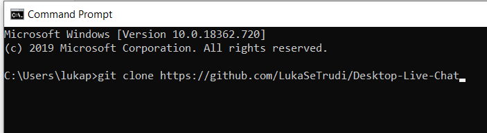
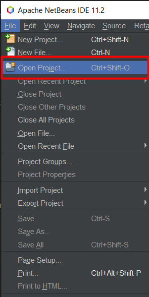
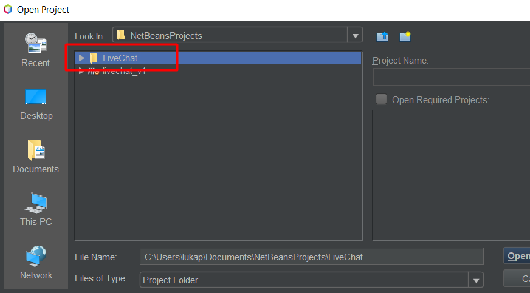
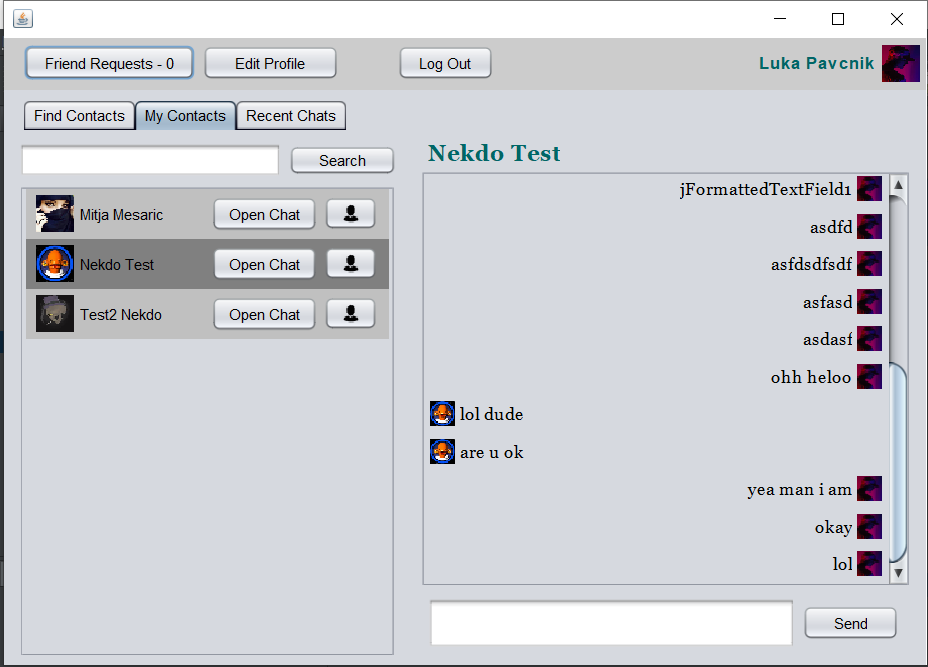
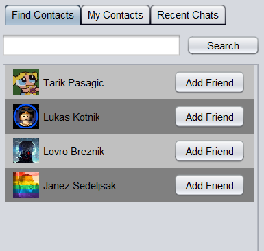
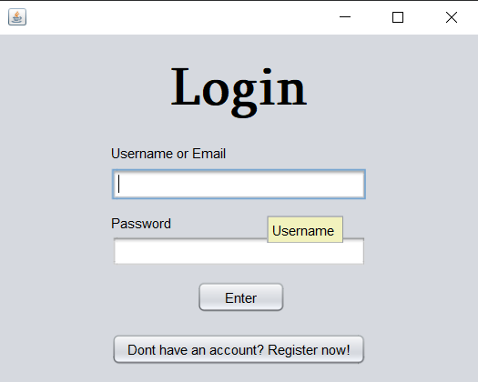
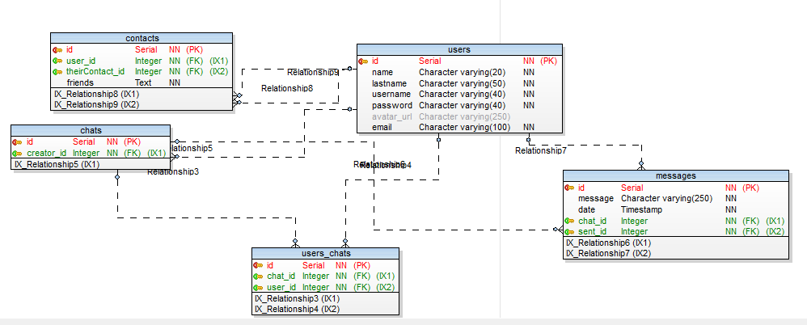

# Live Chat

> Chatting with friends

> Created with Java Swing in Netbeans

> Amazon Web Service postgre database

**Features**

- Searching for contacts

- Adding contacts

- Looking at photos of friends

- Chatting with people


## Table of Contents

- [Installation](#installation)
- [Features](#features)
- [Team](#team)
- [External tools](#external)
- [FAQ](#faq)
- [Support](#support)
- [License](#license)


## Installation

- Live Chat is easy to install
- Just clone the program or download it from git
- You must have netbeans and JRE

### Clone

- Clone this repo to your local machine using `https://github.com/LukaSeTrudi/Desktop-Live-Chat`

```shell
git clone https://github.com/LukaSeTrudi/Desktop-Live-Chat to/your/file/location
```

### Setup

> git clone the package first

[]()

> then open netbeans and select open a new file 

[]()

> after that just find the project and click on it

[]()


## Features

***Live Chatting***
[]()

- Chat with others

***Adding contacts***

[]()

- Here you can search up contacts
- Instantly see ur friends

> Tips

- Add only those you trust
- Have fun

***Login***

[]()

- Instantly login or register

## Team

> Or Contributors/People

- Luka Pavčnik (creator of everything)
- Islam Mušič (moral support)

## External

### ER DIAGRAM

This is ER Diagram made in Toad Data Modeler

;

### Trello link

[Trello] (https://trello.com/b/5AanZCZr/livechat)


## FAQ

- **I cant clone the folder**
    - No problem! Just go to support github and everything will be explained to you there

- **Does this project require Java**
    - Yes for development it requires java development kit, but for runtime in requires JRE java runtime enviroment
---

## Support

Reach out to me at one of the following places!

- Mail at luka.pavcnik5@gmail.com
- Facebook - Luka Pavčnik
- Instagram - Luka Pavčnik
- Snapchat - piggy3211


## Donations

- My Paypal is luka.pavcnik@hotmail.com
- Feel free to send me free money :D


## License

[](http://badges.mit-license.org)

- **[MIT license](http://opensource.org/licenses/mit-license.php)**
- Copyright 2020 © LukaProductions.